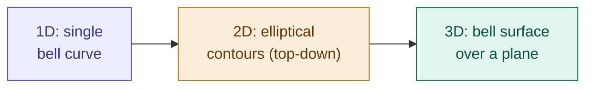

## Definition

Gaussian Discriminant Analysis (GDA) is a [[Generative Learning Algorithms|generative learning algorithm]] that assumes the features $x$ are continuous and that $p(x \mid y)$ — how the features look for each class — follows a **multivariate Gaussian distribution**.

## Setup

We assume $x \in \mathbb{R}^n$ (continuous features), and drop the $x_0 = 1$ bias convention from the feature vector for this derivation. We also assume $p(x \mid y)$ is Gaussian — a reasonable assumption given the nature of continuous data.

## The Multivariate Gaussian

Say we have data $z$ normally distributed with mean $\mu$ and covariance $\Sigma$: $z \sim \mathcal{N}(\mu, \Sigma)$, where $z, \mu \in \mathbb{R}^n$ and $\Sigma \in \mathbb{R}^{n \times n}$.

$$\mathbb{E}[z] = \mu$$

$$\text{Cov}(z) = \mathbb{E}\left[(z-\mu)(z-\mu)^T\right] = \mathbb{E}[z]\mathbb{E}[z]^T - \left(\mathbb{E}[z]\right)\left(\mathbb{E}[z]\right)^T$$

The probability density function for a multivariate Gaussian:

$$\boxed{p(z) = \frac{1}{(2\pi)^{n/2}|\Sigma|^{1/2}} \exp\left(-\frac{1}{2}(x-\mu)^T \Sigma^{-1}(x-\mu)\right)}$$

> At this point we're using the **multivariate** Gaussian — all parameters ($\mu$, $\Sigma$) are vectors/matrices instead of atomic values. It's the natural progression of the standard 1D bell curve, projected into higher-dimensional space instead of just 2D, by introducing more than one random variable into the equation.

### Why $\mu$ is a Vector and $\Sigma$ is a Matrix

- **$\mu$ (the mean)** becomes a vector $\mu \in \mathbb{R}^n$. In 1D the mean is a single number marking the peak on the x-axis; in $n$ dimensions the peak sits at a specific coordinate, so we need $n$ numbers.
- **$\Sigma$ (the variance)** becomes a matrix, called the **covariance matrix**: $\sigma \rightarrow \Sigma \in \mathbb{R}^{n \times n}$.

A vector would only tell you the width of the bell curve along each axis. A **matrix** is required because it captures the covariance — the relationship _between_ features. It also tells the bell curve which direction to rotate or tilt.

## The GDA Model

With two classes $y=0$ and $y=1$:

$$p(x \mid y=0) = \frac{1}{(2\pi)^{n/2}|\Sigma|^{1/2}} \exp\left(-\frac{1}{2}(x-\mu_0)^T\Sigma^{-1}(x-\mu_0)\right)$$

$$p(x \mid y=1) = \frac{1}{(2\pi)^{n/2}|\Sigma|^{1/2}} \exp\left(-\frac{1}{2}(x-\mu_1)^T\Sigma^{-1}(x-\mu_1)\right)$$

This gives the probability density of the features $x$ when $y=0$ or $y=1$. Parameters: $\mu_0, \mu_1 \in \mathbb{R}^n$, $\Sigma \in \mathbb{R}^{n \times n}$.

$$p(y) = \phi^y (1-\phi)^{1-y}$$

The posterior probability of $y$, a Bernoulli random variable (0/1). Parameter: $\phi$.

With $p(x \mid y)$ and $p(y)$ both defined, we can make predictions using Bayes' Rule.

## Fitting the Parameters — MLE

Given a training set ${x^{(i)}, y^{(i)}}_{i=1}^m$, GDA fits parameters via the **joint likelihood** — joint, because we're estimating the joint probability $p(x, y)$, unlike discriminative algorithms which maximize the _conditional_ likelihood $p(y \mid x; \theta)$:

$$\mathcal{L}(\phi, \mu_0, \mu_1, \Sigma) = \prod_{i=1}^{m} p(x^{(i)}, y^{(i)}; \phi, \mu_0, \mu_1, \Sigma)$$

> That's the only real difference between generative and discriminative fitting: discriminative algorithms maximize parameters for $p(y \mid x;\theta)$; generative algorithms maximize likelihood of parameters for the _joint_ probability of both $x$ and $y$.

Taking the log-likelihood, maximizing with respect to each parameter, and dropping constants (the same mechanics as [[Probabilistic Interpretation]]) yields closed-form solutions for all four parameters:

$$\boxed{\phi = \frac{1}{m}\sum_{i=1}^{m} \mathbb{1}{y^{(i)}=1}}$$

$$\boxed{\mu_0 = \frac{\sum_{i=1}^{m} \mathbb{1}{y^{(i)}=0}, x^{(i)}}{\sum_{i=1}^{m} \mathbb{1}{y^{(i)}=0}}} \qquad \boxed{\mu_1 = \frac{\sum_{i=1}^{m} \mathbb{1}{y^{(i)}=1}, x^{(i)}}{\sum_{i=1}^{m} \mathbb{1}{y^{(i)}=1}}}$$

$\mu_0$ is literally the mean of all feature vectors where $y=0$: the numerator sums every $x^{(i)}$ with $y^{(i)}=0$, the denominator counts how many such examples exist. $\mu_1$ is the same, for $y=1$.

$$\boxed{\Sigma = \frac{1}{m}\sum_{i=1}^{m}\left(x^{(i)} - \mu_{y^{(i)}}\right)\left(x^{(i)} - \mu_{y^{(i)}}\right)^T}$$

This single shared covariance matrix fits contours (a 2D Gaussian) to each class, centered on that class's own mean.

## Making Predictions

With $\phi, \mu_0, \mu_1, \Sigma$ fit, predictions use Bayes' Rule:

$$\max_y\ p(y \mid x) = \max_y \left(\frac{p(x\mid y)\cdot p(y)}{p(x)}\right)$$

This produces an exact probability (e.g. 97.8%) — but in reality we only care about **which class name** wins, not the precise probability. So we swap in $\arg\max$ to capture just the winning class:

$$\boxed{\arg\max_y\ p(y\mid x) = \arg\max_y\ p(x\mid y)\cdot p(y)}$$

$p(x)$ was already established to be a constant with respect to $y$ (see [[Generative Learning Algorithms]]), so it drops out entirely.

> **What is $\arg\max$?** "Argument of the maximum." `max` asks _what is the highest value?_ `arg max` asks _which input achieved that highest value?_ Example: given scores {Alice: 85, Bob: 92, Charlie: 78}, `max(score) = 92`, but `arg max(score) = Bob`. We use `arg max` here for two reasons: we only care about the winning class name, not the exact probability, and it lets us drop the $p(x)$ denominator entirely from Bayes' Rule.

## A Small Experiment — GDA Rediscovers the Sigmoid

Take a single-feature, two-class dataset. GDA fits a Gaussian bell curve to each class — $p(x\mid y=0)$ centered at $\mu_0$, $p(x\mid y=1)$ centered at $\mu_1$ — with a decision boundary sitting where the two curves cross.

Assume the classes split 50/50, so $p(y=1) = 0.5$. Now plot $p(y=1\mid x)$ — the predicted probability of class 1 — across the full range of $x$. Far to the left, the probability of class 1 is essentially zero; far to the right, it approaches 1. Plotting this curve reveals something unexpected: it's an S-shaped curve crossing 0.5 right at the boundary — **it exactly matches a sigmoid function**, just like [[Logistic Regression]]. It's just that all the math required for the sigmoid falls out naturally from the GDA algorithm — nobody had to choose it by hand.

## GDA vs. Logistic Regression

Though both algorithms end up using a sigmoid, the parameters they choose to get there are quite different — for the same dataset, GDA and Logistic Regression can produce different decision boundaries and different internal understandings of the data.

**Core difference:**

||Generative (GDA)|Discriminative (Logistic)|
|---|---|---|
|Assumption strength|Strong assumptions|Weak assumptions|
|What it assumes|$x\mid y=0 \sim \mathcal{N}(\mu_0,\Sigma)$, $x\mid y=1 \sim \mathcal{N}(\mu_1,\Sigma)$, $y \sim \text{Bernoulli}(\phi)$|$p(y=1\mid x) = \frac{1}{1+e^{-\theta^T x}}$|

**The implication only runs one way:**

- GDA's assumptions **imply** the logistic form for $p(y=1\mid x)$ — you can derive Logistic Regression's sigmoid starting purely from GDA's Gaussian assumptions.
- Logistic Regression's assumptions do **not** imply GDA's — the reverse derivation is impossible, because Logistic Regression's assumption set is strictly weaker.

**What this means in practice:**

- Generative algorithms make **stronger** modeling assumptions than discriminative ones.
- If your stronger assumption is roughly correct, your model does better — you're teaching it more information and a deeper understanding of the data (e.g. actual class shape, not just a boundary).
- If the assumption is wrong (data isn't actually Gaussian), GDA can do _worse_ than the weaker-assumption Logistic Regression, which doesn't care what shape the data takes.

## Implementation

- [[../Implementation/Classification/gaussian_discriminant_analysis.py]]

---

## Related Notes

- [[Generative Learning Algorithms]]
- [[Naive bayes]]
- [[Logistic Regression]]
- [[Probabilistic Interpretation]]

## References

- _Mathematics for Machine Learning_ — Deisenroth et al. (mml-book.github.io)
- Stanford CS229 Lecture Notes — cs229.stanford.edu
- _Dive into Deep Learning_ — d2l.ai