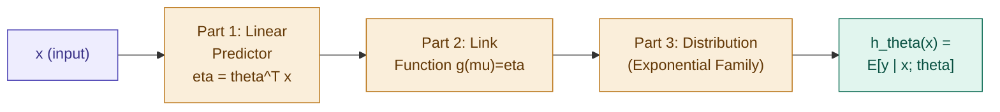
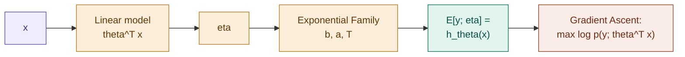

## Definition

A Generalized Linear Model (GLM) is a three-part machine that takes a linear input and transforms it into a probability distribution. If [[Exponential family]] is the blueprint (the DNA), GLMs are the factory that actually builds working algorithms from that blueprint.

## Intuition

In the old way of thinking, Linear Regression and Logistic Regression felt like two separate math problems you had to derive independently. In the GLM view, they're just different settings on the same machine — swap the distribution, and the "factory" hands you a different algorithm automatically, loss function included.

## The Three-Part Machine

**Part 1 — The Linear Predictor ($\eta = \theta^T x$):** We start exactly where [[Linear Regression]] starts. Take the inputs $x$ and combine them linearly with weights $\theta$. This gives the internal score $\eta$.

**Part 2 — The Link Function ($g$):** This is the bridge. Our linear score $\eta$ can be any value from $-\infty$ to $+\infty$, but distribution parameters (like the mean $\mu$, or a probability that must sit between 0 and 1) often have constraints. The link function $g(\mu) = \eta$ connects the unconstrained linear score to the constrained distribution parameter.

**Part 3 — The Distribution (the room):** We select the distribution from the Exponential Family that fits our target data $y$ — continuous data → Gaussian, categorical data → Bernoulli, count data → Poisson.

## The Three Assumptions of a GLM

Building a GLM means committing to exactly three design choices:

1. $y \mid x; \theta \sim \text{ExponentialFamily}(\eta)$ — the data has a specific "shape."
2. $\eta = \theta^T x$ — the relationship is assumed linear in parameter space.
3. $h_\theta(x) = \mathbb{E}[y \mid x; \theta]$ — the prediction _is_ the mean of the distribution.

## This Unifies Everything

Previously, Linear and Logistic Regression looked like separate math problems. In the GLM view, they're just different settings in one factory:

|Task|Distribution|Link Function $g$|Hypothesis $h_\theta(x)$|
|---|---|---|---|
|Regression|Gaussian|$\mu = \eta$|$\theta^T x$|
|Classification|Bernoulli|$\eta = \log\left(\frac{\mu}{1-\mu}\right)$|$\sigma(\theta^T x)$|
|Counts|Poisson|$\eta = \log(\mu)$|$e^{\theta^T x}$|

## Working Through the Pipeline

- The only _learnable_ parameter in a GLM is $\theta$. The Exponential Family's function inputs ($b$, $a$, $T$) are just fixed functions — design choices, not learned weights.
- We choose the distribution based on the data we have: continuous → Gaussian, categorical → Bernoulli, etc.
- Once the distribution is chosen, we get $h_\theta(x)$, our hypothesis, and perform Gradient Ascent — maximizing the log-likelihood $p(y \mid x; \theta)$ with respect to $\theta$.
- That training update is always: $\theta_j := \theta_j + \alpha\left[(y^{(i)} - h_\theta(x^{(i)}))x^{(i)}\right]$

## Terminology Check

- $\mathbb{E}[y;\eta] = g(\eta)$ is called the **canonical response function** — equivalently, $\mu = \mathbb{E}[y;\eta] = g(\eta)$, the mean of the Exponential Family distribution.
- $\mu = g(\eta) \iff g^{-1}(\eta) = \mu$ — we can recover $\mu$ by inverting the canonical response function, called the **canonical link function** ($g^{-1}$).
- $g(\eta) = \frac{\partial}{\partial \eta}a(\eta)$ — $g$ is literally the first derivative of the log-partition function.

**The three parameters, and how they relate:**

$$\theta \xrightarrow{\theta^T x \text{ (design choice)}} \eta \xrightarrow{g} {\phi \text{ (Bernoulli)}, \ \mu,\sigma^2 \text{ (Gaussian)}, \ \lambda \text{ (Poisson)}}$$

$\theta$ (model parameter, learned via gradient ascent) → $\eta$ (natural parameter) → canonical parameter of whichever distribution we picked. The design choice of using $\theta^T x$ (a linear system) is what makes the whole machine, well, a _linear_ model.

## Full Worked Derivation — Logistic Regression from the GLM Blueprint

This is the payoff: deriving Logistic Regression's hypothesis from scratch, using nothing but the GLM's three assumptions.

**Step 1 — Distribution:** $y \mid x;\theta \sim \text{Bernoulli}(\phi)$ — chosen because the data is binary (0 or 1). As an Exponential Family member:

$$p(y;\eta) = \exp\left(y\log\left(\frac{\phi}{1-\phi}\right) + \log(1-\phi)\right)$$

$$\eta = \log\left(\frac{\phi}{1-\phi}\right) \qquad T(y) = y \qquad a(\eta) = -\log(1-\phi) = \log(1+e^\eta)$$

**Step 2 — The Link Function:** In a GLM, $\mu = \mathbb{E}[y] = \phi$. The link function connects the linear predictor $\eta$ to the mean $\phi$. Since $\eta = \theta^T x$:

$$\boxed{\log\left(\frac{\phi}{1-\phi}\right) = \theta^T x}$$

**Step 3 — Solve for $\phi$ to get the hypothesis:**

$$\log\left(\frac{\phi}{1-\phi}\right) = \theta^T x \implies \frac{\phi}{1-\phi} = e^{\theta^T x} \implies \phi = (1-\phi)e^{\theta^T x}$$

$$\phi = \phi e^{\theta^T x} - \phi \cdot e^{\theta^T x} \quad \Rightarrow \quad \phi + \phi \cdot e^{\theta^T x} = e^{\theta^T x}$$

$$\phi(1 + e^{\theta^T x}) = e^{\theta^T x} \implies \phi = \frac{e^{\theta^T x}}{1+e^{\theta^T x}}$$

Divide numerator and denominator by $e^{\theta^T x}$:

$$\boxed{\phi = \frac{1}{1+e^{-\theta^T x}}}$$

**The working hypothesis** — walking through the GLM framework, we arrive at the sigmoid function on its own:

$$h_\theta(x) = \frac{1}{1+e^{-\theta^T x}} = \sigma(\theta^T x)$$

## What's the Point?

You didn't just decide to use a sigmoid function for classification — you _proved_ it. If you assume the data follows a Bernoulli distribution, the math forces the sigmoid to be the only link that maps a linear predictor to a valid probability.

Not only that — because it's Bernoulli, the log-likelihood (MLE) or negative log-likelihood (NLL) calculation automatically forces the cost function to be:

$$J(\theta) = \sum y^{(i)} \log(h_\theta(x^{(i)})) - (1-y^{(i)})\log(1-h_\theta(x^{(i)}))$$

This is Binary Cross-Entropy — exactly [[Logistic Regression]]'s loss function, derived here as a _consequence_ of the Bernoulli assumption, not chosen separately. Which means you never actually have to re-derive it by hand: once you have $h_\theta(x)$ from the GLM framework, you can plug it directly into the same gradient ascent update rule and start learning:

$$\theta_j := \theta_j - \alpha\left[(y^{(i)} - h_\theta(x^{(i)}))x^{(i)}\right]$$

## Implementation

- [[../Implementation/Classification/glm_unified_update.py]]

---

## Related Notes

- [[Exponential family]]
- [[Linear Regression]]
- [[Logistic Regression]]
- [[Softmax Regression]]
- [[Probabilistic Interpretation]]

## References

- _Mathematics for Machine Learning_ — Deisenroth et al. (mml-book.github.io)
- Stanford CS229 Lecture Notes — cs229.stanford.edu
- _Dive into Deep Learning_ — d2l.ai