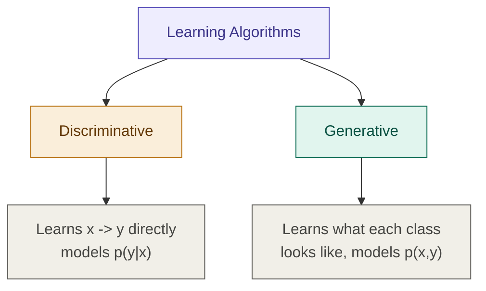

## Definition

Generative Learning Algorithms (e.g. [[Gaussian Discriminant Analysis]], [[Naive bayes]]) are a class of algorithms that learn what each class _looks like_ internally, rather than learning a boundary that separates classes. They model the **joint distribution** $p(x, y)$, then use Bayes' Rule to flip it into a prediction.

## Discriminative vs. Generative

Every algorithm learned so far ([[Linear Regression]], [[Logistic Regression]], [[Support Vector Machines]]) belongs to a different family — **Discriminative Learning Algorithms**. Before going further, it's worth being precise about what separates the two.

**Discriminative algorithm:** $x \rightarrow y$. Learns the decision boundary directly — in other words, learns to separate data points using a line. Models $p(y \mid x)$: the probability of the label given the features.

$$\text{Learns } p(y \mid x) = h_\theta(x) = {0, 1}$$

Simply put: discriminative algorithms just draw a line that separates classes.

**Generative algorithm:** unique because it looks at each class and formulates a class structure internally, then compares a new data point against every class to find which one it's most closely related to.

Internally, it models the **joint distribution** $p(x, y)$ — that is, it learns:

- $p(y)$ — the **prior probability**: how likely each class is overall
- $p(x \mid y)$ — the **likelihood**: how the features look for each class

Then it uses **Bayes' Rule** to get $p(y \mid x)$ for prediction.

Simply put: generative algorithms learn what "Class A" looks like and what "Class B" looks like, then check which one the new data point is closer to.

## Why You Need Bayes' Rule At All

> This is worth sitting with — it's easy to model $p(x,y)$ and then wonder why Bayes' Rule suddenly enters the picture.

In classification, you don't actually care about the exact joint probability $p(x, y)$. You only care about **which class $y$ is most likely given your observed features $x$** — the **posterior probability** $p(y \mid x)$.

Bayes' Rule is the only mathematical formula that connects the joint distribution you modeled to the posterior probability you actually need for prediction:

$$\boxed{p(y \mid x) = \frac{p(x \mid y) \cdot p(y)}{p(x)}}$$

## Computing $p(x)$

The total probability of $x$, via the law of total probability:

$$p(x) = p(x \mid y=1). p(y=1) + p(x \mid y=0). p(y=0)$$

So the full expression for the posterior of class 1:

$$p(y=1 \mid x) = \frac{p(x \mid y=1) \cdot p(y=1)}{p(x)}$$

— the probability of $y=1$ given the observed features $x$.

## Dropping the Denominator

In most cases, we can drop $p(x)$ entirely during prediction — for a given input $x$, the denominator is a **constant** that doesn't depend on $y$. To decide between class A and class B, we only need to compare the numerator:

$$\boxed{\text{prediction} = \arg\max_y \left(p(x \mid y) \cdot p(y)\right)}$$

## What's Actually Left To Do

The task is now clear — everything reduces to defining just two things:

- $p(x \mid y)$ — how the features look for each class
- $p(y)$ — how common each class is overall

Every generative algorithm from here ([[Gaussian Discriminant Analysis]], [[Naive bayes]]) is just a different assumption about the _shape_ of $p(x \mid y)$ — Gaussian for continuous features, Bernoulli/Multinomial for discrete ones.

---

## Related Notes

- [[Gaussian Discriminant Analysis]]
- [[Naive bayes]]
- [[Logistic Regression]]
- [[Supervised Learning]]

## References

- _Mathematics for Machine Learning_ — Deisenroth et al. (mml-book.github.io)
- Stanford CS229 Lecture Notes — cs229.stanford.edu
- _Dive into Deep Learning_ — d2l.ai