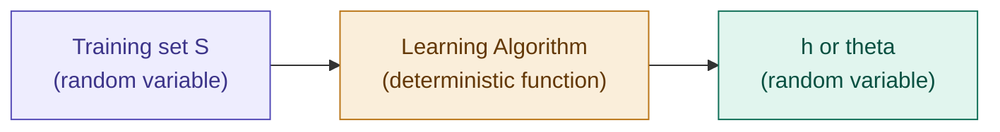

## Definition

Statistical Learning Theory is the theoretical backbone that transforms
machine learning from trial-and-error engineering into rigorous science.
Up to this point, ML was practical — design an algorithm, write a loss
function, let gradient descent optimize weights. Learning Theory asks
the deeper question beneath every training run: **by what right does a
model trained on past data know how to behave on new data?** One short
answer: "history repeats itself." This note bridges building algorithms
to *proving* why they work — why models generalize, how more data
conquers noise, and where the hard boundaries of learning truly lie.

## Assumptions

1. **A data distribution $D$ exists**, from which $(x,y) \sim D$ — both
   train and test data are drawn from the same $D$.
2. **Independent samples:** every example is independent of the others
   — they show a pattern because of the underlying distribution, not
   because of a relationship between individual $(x,y)$ pairs.

## The Learning Setup

Feeding a random variable ($S$) through a deterministic function (the
learning algorithm) produces a random variable: the learned hypothesis
or weights. A learning algorithm is also called an **estimator**, and
$\hat\theta \sim$ some sampling distribution.

In a truly independent dataset, there exists a **true parameter**
$\theta^*$ (or $h^*$) — the perfect weight that fits the data exactly.
The learning algorithm tries its best to match this unknown true
parameter. $\theta^*$ is **not** a random variable — it's a constant we
simply don't know.

## Roadmap

This Assumptions constructs foundation (especially notations) to the topics, in order: [[Bias-Variance Tradeoff]] (parameter
view), [[Empirical Risk Minimization]], [[Uniform Convergence]], and
[[VC Dimension]].

---

## Related Notes
- [[Bias-Variance Tradeoff]]
- [[Empirical Risk Minimization]]
- [[Uniform Convergence]]
- [[VC Dimension]]

## References
- *Mathematics for Machine Learning* — Deisenroth et al. (mml-book.github.io)
- Stanford CS229 Lecture Notes — cs229.stanford.edu
- *Dive into Deep Learning* — d2l.ai

---

**Next:** [[Bias-Variance Tradeoff]]
