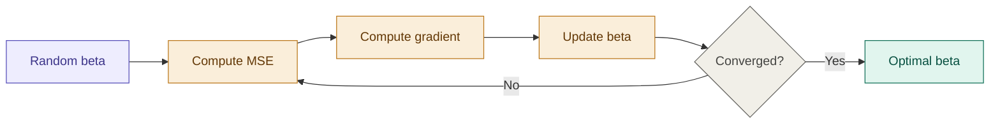

## Definition

Linear Regression is a supervised learning algorithm that models the
relationship between one or more input features and a continuous output
by fitting a straight line (or hyperplane) through the data.

Formally, given input features $x$ and target $y$, the goal is to find
the parameters $\theta$ such that the hypothesis:

$$h_\theta(x) = \theta_0 + \theta_1 x_1 + \theta_2 x_2 + \dots + \theta_n x_n$$

best approximates $y$ across all training examples.

## Intuition

A straight line passing through a scattered plot, adjusted so that the
total squared vertical distance between each point and the line is minimum.

## When to Use It

> The golden rule: start with linear regression as your baseline whenever
> you suspect a roughly linear relationship and need interpretability.

| Situation | Alternative |
|---|---|
| Many features, risk of overfitting | [[Ridge and Lasso Regression]] — shrinks coefficients |
| Residuals show clear curve or cone pattern | [[Decision Trees]] — handles non-linearity naturally |
| Need probability output | [[Logistic Regression]] |

## Key Assumptions

- Linear relationship between $x$ and $y$
- Errors are independent of each other
- Constant variance in errors — **homoscedasticity**

## The Hypothesis

$$h_\theta(x) = w \cdot x + b$$

Where:
- $w$ — weight (slope), controls direction and steepness
- $b$ — bias (intercept), shifts the line up or down
- $x$ — input features

In matrix form, for $n$ training examples:

$$\hat{y} = X^T \cdot \beta \implies [b + x_1 w_1 + x_2 w_2 + \dots + x_n w_n]$$

Where $\beta$ is the parameter vector and $x_0$ in $X$ is always set
to $1$ so the bias $b$ is handled automatically via matrix multiplication:

$$X = \begin{bmatrix} x_0 \\ x_1 \\ x_2 \\ \vdots \\ x_n \end{bmatrix}, \quad
\beta = \begin{bmatrix} b \\ w_1 \\ w_2 \\ \vdots \\ w_n \end{bmatrix}$$

## Objective — Minimize the Loss

We start with random values for $\beta = [b, w]$ and update them
iteratively until predictions converge to actual labels $y$.

The loss function used is **Mean Squared Error (MSE)**:

$$\mathcal{L}(\beta) = \text{MSE} = \frac{1}{n} \sum_{i=1}^{n} (y_i - \hat{y}_i)^2$$

Where $\hat{y}_i = x_i^T \cdot \beta$ is the prediction for example $i$.

In matrix form:

$$\text{MSE} = \frac{1}{n} \left[ y - (X^T \cdot \beta) \right]^2$$

> Note: the square here is not a scalar square — $(y - X^T\beta)$ is a
> vector. Vectors cannot be squared directly, so we use the matrix
> square operation: $(y - X^T\beta)^T \cdot (y - X^T\beta)$

To find the direction that minimises this loss, we compute the slope
of the loss curve — which means taking the derivative of the loss
function with respect to $\beta$.

## Two Methods to Find Optimal Parameters

### Method 1 — Normal Equation (Closed Form)

Take the partial derivative of MSE with respect to $\beta$ and set it
to zero — since at the minimum, the slope of the loss curve is zero:

$$\frac{\partial}{\partial \beta}\ (y - X^T \cdot \beta)^T \cdot (y - X^T \cdot \beta) = 0$$

Expanding:

$$\frac{\partial}{\partial \beta}\ \left[ y^T y - X^T\beta^T y - X^T\beta y^T + X^T\beta^T X^T\beta \right] = 0$$

Since $y^T y$ is a constant with respect to $\beta$, its derivative is zero:

$$-2X^T y + 2X^T X \beta = 0$$

$$X^T X \beta = X^T y$$

Multiply both sides by $(X^T X)^{-1}$:

$$\boxed{\beta = (X^T \cdot X)^{-1} \cdot X^T \cdot y}$$

This equation directly produces the optimal parameters for $\beta$.

> Example: $\beta = [248.203,\ 944.962]$ where $\beta_0 = 248.203$ is
> the bias/intercept and $\beta_1 = 944.962$ is the weight/slope.

**Limitation:** Computing $(X^T X)^{-1}$ is computationally expensive
for large datasets. This is where Gradient Descent becomes necessary.

---

### Method 2 — Gradient Descent (Iterative)

Instead of solving directly, Gradient Descent iteratively updates
$\beta$ by moving in the direction that reduces the loss at each step.

If we plot the loss values against the parameters, we get a curve —
starting high, descending to a minimum, then rising again. The goal
is to reach the bottom of that curve, where the slope is zero.

**Step 1 — Expand MSE with the hypothesis:**

$$\text{MSE} = \frac{1}{n} \sum_{i=1}^{n} \left( y_i - (x_i w + b) \right)^2$$

**Step 2 — Partial derivative with respect to $w$:**

$$\frac{\partial}{\partial w} = \frac{2}{n} \sum_{i=1}^{n} \left( y_i - (x_i w + b) \right) \cdot x_i$$

**Step 3 — Partial derivative with respect to $b$:**

$$\frac{\partial}{\partial b} = \frac{2}{n} \sum_{i=1}^{n} \left( y_i - (x_i w + b) \right) \cdot 1$$

For each iteration, compute both gradients separately, then apply
the **update rule**:

$$\boxed{\beta \leftarrow \beta - \alpha \cdot \frac{\partial\ \text{MSE}}{\partial \beta}}$$

Where:
- $\alpha$ — **learning rate**, controls how large each step is
- $\beta = (b,\ w)$ — parameters being updated simultaneously

> In practice, $\alpha = 0.01$ is a common starting point.

Repeat until the gradients converge to the global minimum — the point
where further updates produce no meaningful change in loss.

## Evaluation Metrics

| Metric | Formula | What it tells you |
|---|---|---|
| $R^2$ | $1 - \dfrac{SS_{res}}{SS_{tot}}$ | Variance explained (0 to 1). Closer to 1 is better. |
| RMSE | $\sqrt{\text{MSE}}$ | Error in original units — interpretable |
| MAE | $\frac{1}{n}\sum\|y_i - \hat{y}_i\|$ | Robust to outliers |

## Sanity Checks — How to Know It Is Failing

- **Residuals $(y - \hat{y})$ vs predicted show a clear pattern** (curve
  or cone shape) — indicates non-linearity or heteroscedasticity.
  Linear regression assumes neither should exist.

- **Adding a random feature increases $R^2$** — that is a sign of
  overfitting. $R^2$ always increases with more features even if
  they are meaningless. Use Adjusted $R^2$ instead.

---

## Implementation

- [[../Implementation/Regression/linear_regression.py]]

## Related Notes

- [[Supervised Learning]]
- [[Loss Functions]]
- [[Gradient Descent]]
- [[Overfitting and Underfitting]]
- [[Ridge and Lasso Regression]]
- [[Logistic Regression]]

## References

- *Mathematics for Machine Learning* — Deisenroth et al. (mml-book.github.io)
- Stanford CS229 Lecture Notes — cs229.stanford.edu
- *Dive into Deep Learning* — d2l.ai