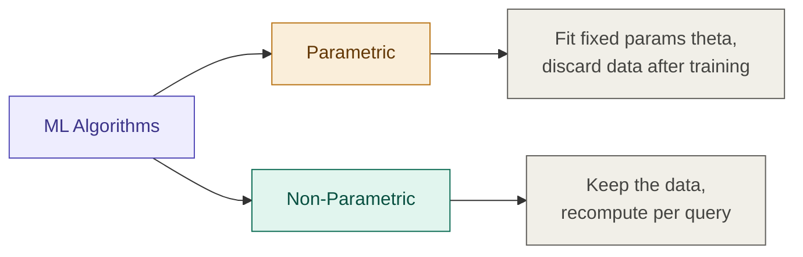
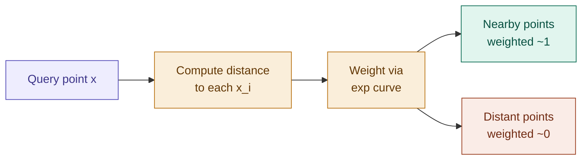

## Definition

Locally Weighted Regression (LWR) is a **non-parametric** regression algorithm that fits a separate, locally-relevant linear model for every point being predicted, by weighting nearby training examples heavily and distant ones lightly.

## Parametric vs. Non-Parametric

Machine learning algorithms fall into two families:

|Type|Behavior|Example|
|---|---|---|
|**Parametric**|Fits a fixed set of parameters $\theta$ to minimize error, then discards the training data — prediction only needs $\theta$|[[Linear Regression]]|
|**Non-Parametric**|Keeps the training data around and re-derives a fit local to each query point|Locally Weighted Regression|

> The amount of "stuff" a non-parametric algorithm needs to keep grows with the size of the training set — that's the trade-off for local accuracy.

## Intuition

Ordinary linear regression fits **one** straight line to the entire dataset, then throws the data away. Locally Weighted Regression instead asks, for every new point $x$ you want to predict: _"which training points are near $x$?"_ — and fits a fresh regression line using mostly those nearby points, weighted by closeness. Far-away points barely count.

## The Objective

In ordinary Linear Regression we fit $\theta$ to minimize:

$$\frac{1}{n}\sum_{i=1}^{n} \left(y^{(i)} - \theta^T x^{(i)}\right)^2$$

In Locally Weighted Regression, we fit $\theta$ to minimize a **weighted** version of the same error:

$$\sum_{i=1}^{m} w^{(i)} \cdot \left(y^{(i)} - \theta^T x^{(i)}\right)^2$$

Where $w^{(i)}$ is the **weight function** — it decides how much training example $i$ should count toward the fit for the current query point $x$.

## The Weight Function

A common choice for $w^{(i)}$:

$$w^{(i)} = \exp\left(-\frac{(x^{(i)} - x)^2}{2\tau^2}\right)$$

This produces a bell-shaped curve centered on the query point $x$:

Behavior of the weight:

$$\begin{cases} \text{if } |x^{(i)} - x| \text{ is small}, & w^{(i)} \approx 1 \ \text{if } |x^{(i)} - x| \text{ is large}, & w^{(i)} \approx 0 \end{cases}$$

> ⚠️ **Flag for review:** the bell curve here _looks_ like a Gaussian PDF, but the notes are explicit that **it is not** — it carries no probabilistic meaning. It's simply a convenient function shape for encoding "closeness." Worth double-checking this framing directly against the CS229 lecture, since it's an easy thing to misremember later.

## The Bandwidth Parameter $\tau$

$\tau^2$ (tau) controls how wide the bell curve is — i.e., how many points count as "local" to $x$:

|$\tau$|Effect|Connects to|
|---|---|---|
|Large $\tau$|Over-saturated local selection — too many points count as "near"|Underfitting|
|Small $\tau$|Narrow, small area of prediction — too few points count|Overfitting|

> Choosing $\tau$ is the LWR equivalent of choosing model complexity — it's the same underfitting/overfitting trade-off as any other model, just controlled by a single bandwidth knob instead of feature count or regularization strength.

## Implementation

- [[../Implementation/Regression/locally_weighted_regression.py]]

---

## Related Notes

- [[Linear Regression]]
- [[Supervised Learning]]
- [[Overfitting and Underfitting]]

## References

- _Mathematics for Machine Learning_ — Deisenroth et al. (mml-book.github.io)
- Stanford CS229 Lecture Notes — cs229.stanford.edu
- _Dive into Deep Learning_ — d2l.ai