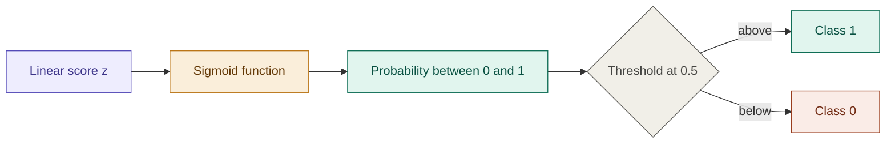

## Definition

Logistic Regression is a supervised learning algorithm used for
classification problems — where the output is a discrete decision
like Yes/No, True/False, or 0/1.

Despite the name, it is a **classification** algorithm, not a
regression one. The "regression" refers to how it works internally:
it fits a line, then squashes it into a probability.

## Why Not Linear Regression for Classification?

Consider a dataset of students — hours studied ($x$) vs pass/fail
($y \in \{0, 1\}$). A linear model fits a straight line and we use
a threshold of 0.5 to classify.

This works *until outliers appear*. When a new extreme point is
added, the best-fit line shifts — and the threshold boundary moves
with it, misclassifying points that were previously correct.

**The conclusion:** a linear model cannot reliably represent
categorical data. We need a function that is naturally bounded
between 0 and 1 and does not shift dramatically with outliers.

## The Sigmoid Function

The function that produces a smooth S-shaped curve bounded between
0 and 1 is the **sigmoid**:

$$\sigma(z) = \frac{1}{1 + e^{-z}}$$

Properties:
- Output always lies in $(0, 1)$ — never exactly 0 or 1 in theory
- Smooth and differentiable everywhere
- Resistant to outliers — extreme inputs saturate near 0 or 1
  rather than shifting the boundary

## The Hypothesis

Let $x^{(i)}$ be the feature vector and $\theta = [\text{bias},
w_1, w_2, \dots, w_n]$ be the parameter vector. The hypothesis is:

$$h_\theta(x) = \frac{1}{1 + e^{-(\theta^T x)}}$$

Since $\theta^T x$ is the linear regression line, logistic regression
is literally **regressing a line, then molding it to fit the range
$[0, 1]$** — hence the name.

The output $h_\theta(x^{(i)})$ represents the **probability** that
$x^{(i)}$ belongs to class 1.

**Decision rule:**

$$\hat{y} = \begin{cases} 1 & \text{if } h_\theta(x) \geq 0.5 \\ 0 & \text{if } h_\theta(x) < 0.5 \end{cases}$$

## Why Not MSE as the Loss?

MSE produces a **non-convex** loss surface for logistic regression
— full of local minima. Gradient descent cannot reliably find the
global optimum. We need a loss function that is convex for the
sigmoid hypothesis.

## The Loss Function — Binary Cross Entropy

We derive the loss from **Maximum Likelihood Estimation**. We want
to find $\theta$ that maximises the probability of observing the
training labels.

We know:

$$P(y=1 \mid x;\theta) = h_\theta(x)$$
$$P(y=0 \mid x;\theta) = 1 - h_\theta(x)$$

These two cases can be merged into one elegant equation:

$$P(y \mid x;\theta) = \left[h_\theta(x)\right]^{y} \cdot \left[1 - h_\theta(x)\right]^{1-y}$$

> This switches off either term based on the value of $y$:
> when $y=1$ the second term disappears, when $y=0$ the first term
> disappears. Clever.

The **likelihood** across all $m$ training examples:

$$\mathcal{L}(\theta) = \prod_{i=1}^{m} \left[h_\theta(x^{(i)})\right]^{y^{(i)}} \cdot \left[1 - h_\theta(x^{(i)})\right]^{1-y^{(i)}}$$

Products are hard to differentiate. Apply $\log$ to both sides
(log-likelihood):

$$\log \mathcal{L}(\theta) = \sum_{i=1}^{m} y^{(i)} \cdot \log(h_\theta(x^{(i)})) + (1-y^{(i)}) \cdot \log(1 - h_\theta(x^{(i)}))$$

This is the **Binary Cross Entropy** loss. We want to **maximise**
this — so we use **Gradient Ascent** (not descent).

## Optimisation — Gradient Ascent

The update rule for each parameter $\theta_j$:

$$\theta_j \leftarrow \theta_j + \alpha \cdot \frac{\partial}{\partial \theta_j} \log \mathcal{L}(\theta)$$

### Deriving the Gradient (Side Work)

First we need $\frac{\partial}{\partial \theta} h_\theta(x)$:

$$\frac{\partial}{\partial \theta} h_\theta(x) = \frac{\partial}{\partial \theta} \frac{1}{1+e^{-\theta^T x}}$$

Applying the chain rule through several steps:

$$\frac{\partial}{\partial \theta} h_\theta(x) = h_\theta(x) \cdot (1 - h_\theta(x)) \cdot x^{(i)}$$

> This is a beautifully clean result — the derivative of the sigmoid
> is the sigmoid multiplied by one minus itself.

### Substituting Back

After substituting $\frac{\partial}{\partial \theta} h_\theta(x^{(i)}) = h_\theta(x^{(i)})(1 - h_\theta(x^{(i)})) \cdot x^{(i)}$ into the gradient and simplifying by taking $x^{(i)}$ common from both terms, everything cancels cleanly to:

$$\boxed{\theta_j \leftarrow \theta_j + \frac{\alpha}{m} \sum_{i=1}^{m} \left( y^{(i)} - h_\theta(x^{(i)}) \right) x^{(i)}}$$

In matrix form (vectorised, no loop needed):

$$\theta \leftarrow \theta + \frac{\alpha}{m} \cdot X^T (y - h_\theta(X))$$

> The $\frac{1}{m}$ scaling factor keeps gradient values proportional
> to the dataset size. Without it, larger datasets produce larger
> raw gradients and the update steps become unstable — this is the
> **gradient explosion** problem. Always include $\frac{1}{m}$.

## The Optimisation Analogy

> Think of training as playing a 3D game where your goal is to guide
> your character (the weights $\theta$) to the winning location on
> the map (the optimal solution).
>
> **The terrain** is determined by your data — it has peaks and
> valleys (the likelihood surface).
>
> **The gravity** is the gradient — it tells you the steepest
> direction to move.
>
> **The joystick** is the learning rate $\alpha$:
> - Too small → painfully slow, might take all night
> - Just right → steady, efficient convergence
> - Too large → overshoot, bounce, fly off the map (model explosion)
>
> **The sensitivity setting** is the $\frac{1}{m}$ factor — it keeps
> the gravity proportional to the size of your world. Without it,
> a large dataset makes your controls too sensitive and you crash
> even with a light touch.
>
> When your loss curves are dancing or weights become NaN, ask:
> *"Is my joystick tilt too aggressive, or is my sensitivity off?"*

## Evaluation Metrics

Unlike regression, we do not use MSE or $R^2$ here. Classification
has its own metrics:

| Metric    | Formula                                           | What it tells you                                          |
| --------- | ------------------------------------------------- | ---------------------------------------------------------- |
| Accuracy  | $\frac{\text{correct predictions}}{\text{total}}$ | Overall correctness — misleading on imbalanced data        |
| Precision | $\frac{TP}{TP + FP}$                              | Of all predicted positives, how many are actually positive |
| Recall    | $\frac{TP}{TP + FN}$                              | Of all actual positives, how many did we catch             |
| F1 Score  | $\frac{2 \cdot P \cdot R}{P + R}$                 | Harmonic mean of precision and recall                      |

> When classes are imbalanced (e.g. 95% fail, 5% pass), accuracy
> is useless. F1 score is the reliable metric.

## Implementation

- [[../Implementation/Classification/logistic_regression.py]]

## Related Notes

- [[Supervised Learning]]
- [[Linear Regression]]
- [[Loss Functions]]
- [[Gradient Descent]]
- [[Sigmoid Function]]
- [[Overfitting and Underfitting]]

## References

- *Mathematics for Machine Learning* — Deisenroth et al. (mml-book.github.io)
- Stanford CS229 Lecture Notes — cs229.stanford.edu
- *Dive into Deep Learning* — d2l.ai