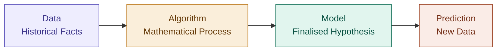

# Machine Learning

## Definition

Machine Learning (ML) is a field of computer science that enables computers
to learn from data and make decisions based on experience, without being
explicitly programmed for every task.

## Intuition

Think of it like teaching a child to recognize fruits. Instead of writing
a rigid rulebook — *"if red, if round, if smooth → apple"* — you show the
child hundreds of pictures. Over time, the child builds their own mental
model, recognizing patterns without anyone spelling out the rules.

ML works the same way. The algorithm finds the patterns. You just supply
the examples.

## Purpose

To automate decision-making, uncover hidden patterns, and make accurate
predictions on new, unseen data — by learning from historical patterns.

## The ML Pipeline

The fundamental flow of any ML project:

| Stage      | What it is                     | Analogy          |
| ---------- | ------------------------------ | ---------------- |
| Data       | Historical facts               | Experience       |
| Algorithm  | Mathematical learning process  | Study method     |
| Model      | The finalized hypothesis       | Knowledge gained |
| Prediction | Applying the model to new data | Taking the exam  |

## How Learning Happens

**1. Training**
The algorithm is fed data. It calculates errors, adjusts its internal
parameters (weights), and iterates — converging toward the best
mathematical representation of the input data.

**2. Validation**
The model is tested on data it has never seen. This ensures it has
learned to *generalize*, not memorize. Memorization is a failure mode
called **overfitting** — caused by high variance.

**3. Deployment**
Once performance is satisfactory, the model is applied to real-world
decisions.

## Types of Learning

### Supervised Learning
Learning *with* labeled data — a teacher provides the correct answers.

> **Example:** Predicting house prices from historical sales data.

### Unsupervised Learning
Learning *without* labels — the algorithm finds structure on its own.

> **Example:** Grouping customers by purchasing behavior (clustering).

### Reinforcement Learning
Learning through trial and error — actions are rewarded or penalized.

> **Example:** Training an AI to play chess or navigate a self-driving car.

## The Golden Rule

> *Garbage In = Garbage Out.*

No matter how sophisticated the algorithm, the quality of the model can
never exceed the quality of its input data. Data is not just a starting
point — it is the foundation everything else is built on.

---

## Related Notes
- [[Supervised Learning]]
- [[Unsupervised Learning]]
- [[Reinforcement Learning]]
- [[The ML Pipeline]]
- [[Overfitting and Underfitting]]

## References
- *Mathematics for Machine Learning* — Deisenroth et al. (mml-book.github.io)
- *Dive into Deep Learning* — d2l.ai
- Stanford CS229 Lecture Notes — cs229.stanford.edu