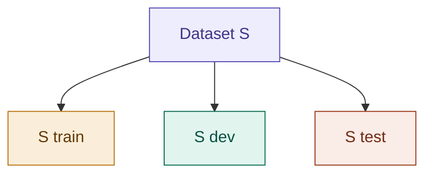

## Definition

Model Selection is the problem of choosing between several candidate
models $M_1, M_2, \dots, M_n$ — e.g. polynomial degree 1 vs. 2 vs. 5, or
different values of $\lambda$. Cross-Validation is the family of
techniques used to make that choice honestly, using data the model
hasn't been trained on.

## Why Training Error Fails

The naive approach: pick whichever model has the lowest training error.
This fails badly — training error always decreases as model complexity
increases, so this method will always select the model with the
highest variance — the most overfit model (see
[[Bias And Variance]]). You need a way to estimate error on data
the model hasn't seen.

## Splitting the Dataset

The most reasonable suggestion: split the dataset $S$ into 2–3 parts.
Train the model on the first part (**train set**), and use the
remaining part(s) for measuring the model's generalization (**test
set** / **dev set**, where dev set = development set).



A generally practical split — if $S$ = 100 examples:

| Split | Fraction |
|---|---|
| $S_{train}$ | 90–90% |
| $S_{dev}$ | 5–5% |
| $S_{test}$ | 5–5% |

- Train each model (up to $n^{th}$ degree polynomial) on $S_{train}$,
  getting hypothesis $h_i$ for each candidate model.
- Measure the error on $S_{dev}$, and pick the model with lowest error
  on $S_{dev}$.
- **Optionally:** evaluate the chosen algorithm's error on a separate
  **test set** ($S_{test}$) and report that result — for academic paper
  publication purposes, because most algorithms are optimized for the
  dev set, so it's recommended to use a separate test set to evaluate
  the learning algorithm honestly. You can ignore the test set for a
  purely product-based project or informal experiments.

## Why the Test Set Should Be a Bit Larger Than Dev

Say you're choosing a model from different-order polynomials based on
error:

| Degree | $S_{dev}$ error |
|---|---|
| 1 | 10 |
| 2 | 5.1 |
| 3 | 5.0 |
| 4 | 4.9 |
| 6 | 7 |
| 7 | 10 |

At orders 2, 3, and 4 the error is very close to 5, but the 4th degree
got 4.9 — that doesn't mean it's actually the lowest-error model. It
might just be that there's noise in the data that happened to cause the
2nd and 3rd order to show a little more error. That 4.9 for the 4th
order polynomial isn't *earned* — it just got lucky that the
complexity of the 4th-order polynomial happened to converge onto that
noise in order to get the lowest error.

That's the reason a **test set** the model has never seen — and a bit
large compared to dev — matters:

| Degree | $S_{dev}$ error | $S_{test}$ error |
|---|---|---|
| 1 | 10 | 10 |
| 2 | 5.1 | 5.0 |
| 3 | 5.0 | 5.0 |
| 4 | 4.9 | 5.0 |
| 5 | 7 | 7 |
| 6 | 10 | 10 |
| 7 | 11.2 | 11.2 |

Now degrees 2, 3, and 4 have a more generalized error view — on the
test set, they're all tied at 5.0. It's not a good idea to publish that
your model scored 4.9 error on the dev set; showing the test set's
result gives a more valid assumption about the learning algorithm.

## Hold-Out Cross Validation (Simple CV)

1. Randomly split data $S$ into $S_{train}$ (~70%) and $S_{test}$
   (~30%, the hold-out set).
2. Train each candidate model $M_i$ on $S_{train}$ only, getting
   hypothesis $h_i$.
3. Evaluate each $h_i$ on $S_{test}$ and pick the one with lowest error:

$$\boxed{\hat\varepsilon_{S_{test}}(h_i)}$$

4. **(Optional, but common)** retrain the winning model on the full
   dataset $S$ (train + test) for the final version. You already used
   the test set (cross-validation set) to *pick* the model, so there's
   no harm folding it back in for the final fit.

**The drawback:** you're wasting 30% of your data — it never
contributes to training any model you actually keep. What if you have
very little data to split?

## k-Fold Cross Validation

Fixes the waste, at the cost of more compute:

- Split $S$ into $k$ disjoint subsets $S_1, S_2, \dots, S_k$ (a typical
  choice is $k=10$).
- For each $j=1,\dots,k$: train model $M_i$ on everything except $S_j$
  (i.e. $S_1 \cup \dots \cup S_{j-1} \cup S_{j+1} \cup \dots \cup S_k$),
  getting hypothesis $h_{ij}$. Test it on the held-out $S_j$.
- Average the $k$ error estimates to get an overall estimate of $M_i$'s
  generalization error.
- Pick $M_i$ with the best average error, then retrain on the entire
  dataset $S$ for the final model.

Every point gets used for training in $k{-}1$ of the $k$ rounds, and for
validation exactly once — much less wasteful than hold-out cross
validation, but you now train $k$ times per candidate model instead of
once.

**Pseudocode**, for $k=5$:

```
for d = 1 ... 10 (degree of polynomial) {
    for i = 1 ... k:
        Train (fit parameters) on k-1 pieces
        Test on remaining k-th piece
    Average
}
```

## Leave-One-Out Cross Validation

Say you have a very small dataset — under 100, or ~100–200 examples.
The special case $k = m$ (number of folds = number of training
examples). Each fold holds out exactly **one** example. This is
standard practice specifically when you have a very small dataset and
can't afford to hold out even 10% of it for validation.

## Feature Selection — A Special Case of Model Selection

When you have $d$ features but suspect only a handful are actually
relevant (common when $d$ is huge, even $d \gg m$), you can treat "which
subset of features to use" as a model-selection problem. Each candidate
feature subset is a candidate model $M_i$, scored via cross-validation.
Since there are $2^d$ possible subsets, checking all of them is
infeasible, so:

- **Forward search:** start with an empty feature set, repeatedly add
  whichever single feature improves cross-validation error the most,
  stop when adding features no longer helps.
- **Backward search:** start with all features, repeatedly remove
  whichever single feature hurts CV error the least, until you're down
  to none.

## Implementation

- [[../Implementation/Regression/model_selection_cv.py]]

---

## Related Notes
- [[Bias And Variance]]
- [[Regularization]]
- [[Overfitting and Underfitting]]

## References
- *Mathematics for Machine Learning* — Deisenroth et al. (mml-book.github.io)
- Stanford CS229 Lecture Notes — cs229.stanford.edu
- *Dive into Deep Learning* — d2l.ai
