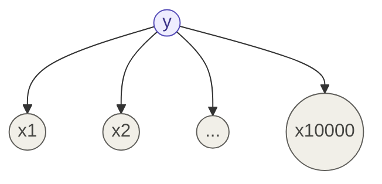

## Definition

Naive Bayes is yet another [[Generative Learning Algorithms|generative learning algorithm]] that works similarly to [[Gaussian Discriminant Analysis]], but for **discrete data** instead of continuous. Its defining move is the "naive" assumption: given the class label, every feature is conditionally independent of every other feature.

## Motivating Example — Spam Classification

Say the features $x$ are discrete — e.g. word count: `1` if the word "money" appears in an email, else `0`. We can't use GDA here, because the Gaussian distribution assumes continuous, bell-curved data; plugging binary 0/1 data into a Gaussian breaks its assumptions and yields terrible results. We need a new way to model $p(x \mid y)$ for discrete features.

## Step 1 — Representing an Email as a Feature Vector

To let a computer process an email, build a **vocabulary** — a list of all possible words we care about. The size of this vocabulary is the dimension of the feature vector. In practice, the vocabulary is built from words appearing in the training set, often excluding very common "content-free" words like "the," "of," "and."

For any email, construct feature vector $x$:

$$x_i = \mathbb{1}{\text{word } i \text{ appears in the email}}$$

If the vocabulary has 10,000 words, $x$ is a 10,000-dimensional vector of 0s and 1s: $x \in {0,1}^{10{,}000}$.

## Step 2 — The Parameter Explosion

We want to model $p(x \mid y)$ and $p(y)$. But there are $2^{10{,}000}$ possible values of $x$ — modeling this directly as a multinomial vector would need $2^{10{,}000} - 1$ parameters. This is not feasible with any amount of data in the universe.

## The Naive Bayes Assumption

To solve this explosion of parameters, we make a heroic, mathematically simplified assumption: given the class label $y$, the features $x_j$ are **conditionally independent** of each other.

**What is conditional independence?** Once you know the class label is spam or not spam, whether or not each word appears is independent of every other word.

In plain English: if you know an email is spam, the probability that "money" appears is independent of whether "bank" appears. We know this is false in real life (spam words often cluster together) — but we're willing to sacrifice that accuracy for computational feasibility.

While this is mathematically inconsistent with how language actually works, it's okay — the assumption still produces a useful classifier.

This assumption translates directly into the Bayes numerator:

$$p(x_1, x_2, \dots, x_{10{,}000} \mid y) = p(x_1\mid y), p(x_2\mid y), p(x_3\mid y) \cdots p(x_{10{,}000}\mid y)$$

$$\boxed{p(x\mid y) = \prod_{i=1}^{n} p(x_i \mid y)}$$

Now, instead of $2^n$ parameters, we only need $2n$ parameters — the probability of each word appearing, given the class.

## Step 3 — Define the Parameters

$$\phi_{j\mid y=1} = p(x_j=1 \mid y=1) \qquad \phi_{j\mid y=0} = p(x_j=1 \mid y=0) \qquad \phi_y = p(y=1)$$

- $\phi_{j\mid y=0}$ — probability of word $j$ appearing in a non-spam email
- $\phi_{j\mid y=1}$ — probability of word $j$ appearing in a spam email

## Step 4 — Estimate via MLE

The joint likelihood:

$$\mathcal{L}(\phi_y, \phi_{j\mid y}) = \prod_{i=1}^{m} p(x^{(i)}, y^{(i)}; \phi_y, \phi_{j\mid y})$$

Maximum Likelihood Estimation, after taking the log and partial derivatives (same mechanics as [[Gaussian Discriminant Analysis]] and [[Probabilistic Interpretation]]), gives clean closed-form solutions:

$$\boxed{\phi_y = \frac{\sum_{i=1}^{m} \mathbb{1}{y^{(i)}=1}}{m}}$$

$$\boxed{\phi_{j\mid y=1} = \frac{\sum_{i=1}^{m}\mathbb{1}{x_j^{(i)}=1,\ y^{(i)}=1}}{\sum_{i=1}^{m}\mathbb{1}{y^{(i)}=1}}}$$

> Similar to GDA! ($y=1$ here means spam.)

## Summary So Far

- Discriminative models fail with small data; the fix is to model the joint distribution $p(x,y)$ — that's what makes an algorithm generative.
- To get a classification out of a joint distribution solution, use Bayes' Rule to flip it into $p(y\mid x)$.
- How to define $p(x\mid y)$ depends on the data type: **continuous** → [[Gaussian Discriminant Analysis]] (relates to Logistic Regression); **discrete** → Naive Bayes (word counts).

## The Zero-Probability Problem — Why MLE Alone Isn't Enough

> A football team has played 5 games and lost all 5. What's the probability they win their 6th game?

If you use Maximum Likelihood Estimation and just look at the data:

$$p(\text{win}) = \frac{#\text{wins}}{#\text{wins} + #\text{losses}} = \frac{0}{5} = 0$$

That's both mean and mathematically arrogant — you're claiming 100% certainty the team can _never_ win again, just because of 5 sequential losses. That's ridiculous.

**The same failure hits Naive Bayes directly:** what if word $j$ never appeared in any spam email in the training set? MLE says $\phi_{j\mid y=1} = 0/n = 0$. Multiply that zero into the product over all words, and the _entire_ probability collapses to zero — the classifier ends up asserting "an email containing word $j$ is spam" is a flat-out impossible statement, regardless of every other word in the email. Clear overconfidence, and wrong.

## The Fix — Laplace Smoothing

Simple: we pretend. We gracefully say "let's pretend the team played 2 more games, winning 1 and losing 1":

$$\text{Win prob} = \frac{(#\text{wins})+1}{(#\text{wins})+1 + (#\text{losses})+1} = \frac{0+1}{5+2} = \frac{1}{7}$$

That feels far more reasonable — we didn't let 5 losses bully us into saying zero.

Applying the identical trick to Naive Bayes — pretend we saw every word once in a spam email and once in a non-spam email:

$$\boxed{\phi_{j\mid y=1} = \frac{\text{count}(x_j=1 \cap y=1) + 1}{\text{count}(y=1) + 2}}$$

This keeps Bayes' multiplication safe, ensuring the model can still evaluate emails containing previously unseen words — that solves the zero-probability issue entirely.

## Implementation

- [[../Implementation/Classification/naive_bayes.py]]

---

## Related Notes

- [[Generative Learning Algorithms]]
- [[Gaussian Discriminant Analysis]]
- [[Probabilistic Interpretation]]

## References

- _Mathematics for Machine Learning_ — Deisenroth et al. (mml-book.github.io)
- Stanford CS229 Lecture Notes — cs229.stanford.edu
- _Dive into Deep Learning_ — d2l.ai