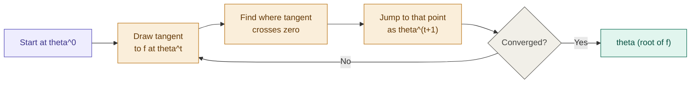

## Definition

Newton's Method is an alternative optimization algorithm to Gradient Descent/Ascent. Where they differ is **convergence speed** — Newton's Method reaches the global minimum (or maximum) in far fewer iterations, at the cost of a much heavier computation per step.

## Intuition

Instead of taking small steps in the direction of the gradient like [[Gradient Descent]], Newton's Method repeatedly draws the **tangent line** to the function at the current point, and jumps straight to where that tangent crosses zero. Each jump lands much closer to the true root than a fixed-size gradient step would.

## The Setup

Say we have a function $f(\cdot)$ and want to find $\theta$ such that:

$$f(\theta) = 0$$

What we actually want is to **maximize** $\ell(\theta)$ (the log-likelihood) — i.e. we want $\ell'(\theta) = 0$, the first-order derivative. So the root-finding function $f$ will end up being $\ell'(\theta)$ itself.

## Deriving the Update Rule

At each iteration, take the tangent line to $f$ at the current point $\theta^{(0)}$. From the graph: the **vertical distance** from $\theta^{(0)}$ to its projection on $f(\cdot)$ is $f(\theta^{(0)})$, and the **horizontal distance** between $\theta^{(0)}$ and the next iterate $\theta^{(1)}$ is denoted $\Delta$.

The learning algorithm is therefore:

$$\theta^{(1)} = \theta^{(0)} - \Delta$$

To solve for $\Delta$: the tangent's slope is the derivative $f'(\theta^{(0)})$, and by the definition of slope (opposite/adjacent):

$$f'(\theta^{(0)}) = \frac{f(\theta^{(0)})}{\Delta} \implies \boxed{\Delta = \frac{f(\theta^{(0)})}{f'(\theta^{(0)})}}$$

Plugging $\Delta$ back into the update rule generalizes to iteration $t$:

$$\theta^{(t+1)} = \theta^{(t)} - \frac{f(\theta^{(t)})}{f'(\theta^{(t)})}$$

Since $f(\theta) = \ell'(\theta)$ (we're root-finding the _first_ derivative), this update rule needs $f'(\theta) = \ell''(\theta)$ — the **second**-order derivative:

$$\boxed{\theta^{(t+1)} = \theta^{(t)} - \frac{\ell'(\theta^{(t)})}{\ell''(\theta^{(t)})}}$$

## Vector Form — The Hessian Matrix

When $\theta$ is a vector rather than a scalar (the normal case in ML, where $\theta \in \mathbb{R}^{n+1}$), the single second derivative generalizes to the **Hessian matrix** $H$:

$$H_{ij} = \frac{\partial^2 \ell}{\partial \theta_i \partial \theta_j}$$

And the update rule becomes:

$$\theta^{(t+1)} := \theta^{(t)} + H^{-1} \nabla_\theta \ell$$

Where $H \in \mathbb{R}^{(n+1)\times(n+1)}$ is a square matrix, and $\nabla_\theta \ell \in \mathbb{R}^{n+1}$ is the gradient vector.

## The Drawback — Inverting $H$

This is where Newton's Method's reputation as "alternative" (rather than "replacement") comes from: **$H^{-1}$**.

- The Hessian is $(n+1) \times (n+1)$ — for 5 features, that's already a 6×6 matrix.
- Manageable for tens or hundreds of features.
- For 10,000 or 1,000,000 features, inverting a 10,000×10,000 matrix per iteration is a nightmare — this is exactly why Newton's Method becomes expensive on high-dimensional or heavy datasets, while Gradient Descent stays cheap per step regardless of feature count.

## Convergence Speed

Aside from the Hessian cost, Newton's Method is remarkably accurate. Example progression of loss across iterations:

$$0.01 \rightarrow 0.0001 \rightarrow 0.00000001$$

That's the loss shrinking by roughly the square of its previous value at every step — this convergence behavior is called **Quadratic Convergence**, and it's substantially faster than Gradient Descent's linear convergence.

## When to Use Which

||Newton's Method|Gradient Descent/Ascent|
|---|---|---|
|Convergence speed|Fast (quadratic) — few iterations|Slow (linear) — many iterations|
|Cost per iteration|Expensive — requires inverting $H$|Cheap — one gradient computation|
|Best for|Low-to-moderate feature counts|High-dimensional / large-scale data|

## Implementation

- [[../Implementation/Classification/newtons_method.py]]

---

## Related Notes

- [[Logistic Regression]]
- [[Gradient Descent]]
- [[Probabilistic Interpretation]]

## References

- _Mathematics for Machine Learning_ — Deisenroth et al. (mml-book.github.io)
- Stanford CS229 Lecture Notes — cs229.stanford.edu
- _Dive into Deep Learning_ — d2l.ai