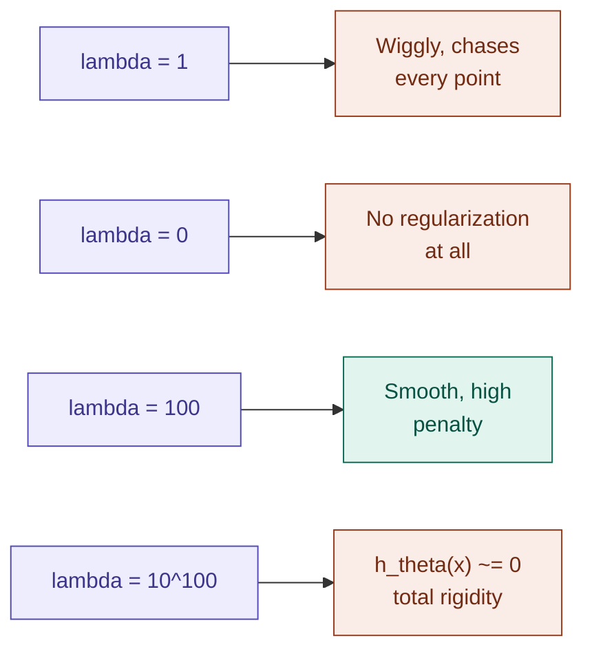

## Definition

Regularization is a technique used to prevent overfitting by adding a
**penalty term** to a learning algorithm's cost function. Suppose you're
building a very big model by adding enough features to the
feature-space — be it linear, logistic regression, or support vector
machine — you can often easily overfit the data. One of the most
effective ways to prevent this is regularization.

## The Penalty Term

The penalty term looks like this:

$$\boxed{\lambda \cdot \|\theta\|^2}$$

## Implementation — Linear Regression

In standard [[Linear Regression]], you minimize the squared error.
With regularization, add the penalty term to the objective function:

$$\boxed{\min_\theta\ \frac{1}{2}\sum_{i=1}^{m}\left\|y^{(i)} - \theta^Tx^{(i)}\right\|^2 + \underbrace{\frac{\lambda}{2}\|\theta\|^2}_{\text{regularization}}}$$

## The Effect of $\lambda$

Take a linear regression overfitting example — fitting a high-degree
polynomial to noisy data at different values of $\lambda$:

![[reg_test.png]]

The plot above shows the same degree-12 fit at four values of $\lambda$
(`0`, `1`, `100`, `10^{10}$` standing in for $10^{100}$). At $\lambda = 0$
there is no penalty at all, so the fit chases the noise; $\lambda = 1$ is
still too weak to stop it. By $\lambda = 100$ the curve has been pulled
smooth and generalizes best of all four, and at the extreme it collapses
onto a near-constant line.

The $\lambda$ term gives control over the model's rigidness:

- **$\lambda$ (lambda)** is a hyperparameter that balances the
  [[Bias And Variance|bias-variance trade-off]].
- **$\lambda$ is very large** — high penalty — all parameters $\theta$
  are forced close to zero, leading to underfit (very rigid). At the
  extreme ($\lambda = 10^{100}$), $h_\theta(x) \approx 0$.
- **Optimal $\lambda$** is some intermediate value that provides the
  best balance.

## Key Takeaways for Model Development

**Feature scaling:** it is standard practice to normalize features
(subtract the mean, divide by standard deviation) to a similar scale
(e.g. 0 to 1, or −1 to 1) before applying regularization — this ensures
all parameters are penalized appropriately and helps gradient descent
run faster.

**Bayesian Perspective:** regularization can be viewed as **Maximum A
Posteriori (MAP)** estimation. If you assume a Gaussian prior on your
parameters $\theta$ (centered at zero), the mathematical derivation of
the posterior distribution leads directly to the same regularization
penalty.

## Why Not a Per-Parameter $\lambda$?

We don't usually use a different $\lambda$ for every parameter, because
choosing 10,000 individual $\lambda$ values for 10,000 parameters is as
difficult as training the original model. But a single unified $\lambda$
works better, because you have one unified parameter to scale all the
$\theta$ parameters.

Even implementing per-parameter regularization would give even more
control over the decision boundary/regression line, but it just happens
to be inefficient:

$$\boxed{\lambda \cdot \|\theta\|^2} \quad \text{is easy, compared to} \quad \boxed{\sum_{i=1}^{n}\lambda_i (\theta_i)^2}$$

## Regularization in GLMs

The equation above states how to implement the regularization penalty
for minimization problems. But when it comes to
[[Generalized linear models|GLMs]], we **negate** the penalty — for
example in [[Logistic Regression]]:

$$\boxed{\arg\max_\theta \ \sum_{i=1}^{m}\log\left(p(y^{(i)}\mid x^{(i)};\theta)\right) - \lambda\|\theta\|^2}$$

Because in GLMs we **maximize** log-likelihood instead of minimizing a
loss, we negate the regularization penalty term to the equation (as it
should be), so the penalty still discourages large $\theta$ values.

## SVM's Implicit Regularization

Despite performing computation in infinite-dimensional space,
[[Support Vector Machines|SVM]] doesn't seem to overfit. The reason is
clear and self-explanatory once you look at both the regularization term
and the SVM optimization objective term side by side:

$$\text{Regularization} = \lambda \cdot \|\theta\|^2 \qquad\qquad \text{SVM} = \frac{1}{2}\|w\|^2$$

There is a well-defined proof, but simply put: SVM has the property — or
effect — that it regularizes its own weights, entirely as a side effect
of the [[Optimal margin classifier|margin-maximizing objective]] it was
already solving.

## Implementation

- [[../Implementation/Regression/regularization.py]]

---

## Related Notes
- [[Bias And Variance]]
- [[Overfitting and Underfitting]]
- [[Linear Regression]]
- [[Logistic Regression]]
- [[Generalized linear models]]
- [[Support Vector Machines]]
- [[Probabilistic Interpretation]]

## References
- *Mathematics for Machine Learning* — Deisenroth et al. (mml-book.github.io)
- Stanford CS229 Lecture Notes — cs229.stanford.edu
- *Dive into Deep Learning* — d2l.ai

---

**Next:** [[Learning Theory]]
