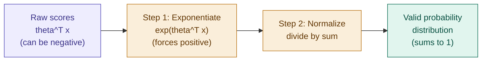

## Definition

Softmax Regression is the generalization of [[Logistic Regression]] to **multi-class classification**. Where Logistic Regression handles binary choices (0 or 1), Softmax Regression handles $K$ classes at once — e.g. classifying an object as a circle, square, or triangle.

## Intuition

Logistic Regression learns a single vector $\theta$ and squashes its score into $[0,1]$ with the sigmoid. Softmax Regression instead learns a **dedicated parameter vector $\theta^{(k)}$ for every class $k$**, and squashes the _entire vector_ of raw class scores into a full probability distribution that sums to 1 — the sigmoid's multi-class big sibling.

## Architecture

Instead of one single vector $\theta$, we assign a dedicated parameter vector $\theta^{(k)}$ for each class $k$ — meaning $\theta$ is now a **matrix**, not a vector:

$$\theta = \begin{bmatrix} \text{---} \ \theta^1 \ \text{---} \\ \text{---} \ \theta^2 \ \text{---} \\ \vdots \\ \text{---} \ \theta^k \ \text{---} \end{bmatrix} \in \mathbb{R}^{n \times k}$$

- If you have $K$ classes, your model learns $K$ different parameter vectors.
- Given an input $x$, the model computes a raw score (logit) for **every** class: $z_k = \theta^{(k)T} x$

Notation used throughout:

- $x^{(i)} \in \mathbb{R}^n$
- $K$ = number of classes
- Label $y = {0,1}^K$, e.g. $[0,0,1]$ — a **one-hot vector**
- $\theta_{\text{class}} \in \mathbb{R}^n$ for each of the $K$ classes

## From Raw Scores to a Probability Distribution

Say the model produces raw scores $\theta^T_{\text{class}} \cdot x$ for three classes — a square gets a high score, a triangle a low score, and a circle a negative score. Two problems: scores can be negative, and they don't sum to anything meaningful.

**Step 1 — Exponentiation:** compute $\exp(\theta_c^T x)$ for each class. This forces every value to be positive — no more negative "probabilities."

**Step 2 — Normalize:** divide each exponentiated score by the sum of all exponentiated scores:

$$\frac{\exp(\theta_c^T x)}{\sum_{i \in {classes}} \exp(\theta_i^T x)}$$

## The Softmax Formula

$$\boxed{p(y=k \mid x;\theta) = \frac{\exp(\theta_{\text{class}}^T x)}{\sum_{j=1}^{K} \exp(\theta_j^T x)}}$$

> This is exactly the two-step process above, written as one equation: exponentiate the numerator, normalize by summing the same exponentiation across every class in the denominator.

## The Squash Mechanism

- **Sigmoid** squashes a single score into $[0,1]$ — one number, one probability.
- **Softmax** squashes an entire _vector_ of scores into a full probability distribution that sums to exactly 1 — many numbers, one joint distribution.

Softmax is to multi-class classification what the sigmoid is to binary classification — the same "squash raw scores into valid probability" idea, generalized from one score to $K$ scores at once.

## The Training Objective

We don't just fit a line — we force the model's entire output distribution to match the "ground truth" label.

- **Target label ($y$):** represented as a one-hot vector. If the true class is "Triangle" out of 3 classes: $y = [0, 0, 1]$
- **Prediction $\hat{p}(y)$:** the model's probability distribution $[p_1, p_2, p_3]$, e.g. $[0.1, 0.1, 0.8]$
- **Cross-Entropy:** the model learns by minimizing the "distance" (cross-entropy) between its predicted distribution and the one-hot target label.

The learning rule treats the output as a probability distribution and uses gradient descent to minimize cross-entropy loss — this effectively pushes the correct class's score up and every other class's score down, simultaneously, every training step.

## Summary

- **Softmax is a generalization:** it is to multi-class classification what [[Logistic Regression]] is to binary classification.
- **The squash mechanism:** sigmoid squashes a scalar into $[0,1]$; softmax squashes a vector of scores into a probability distribution that sums to 1.
- **The learning rule:** treat the output as a probability distribution, minimize cross-entropy via gradient descent, and every training step simultaneously pushes the correct class up and the rest down.

## Implementation

- [[../Implementation/Classification/softmax_regression.py]]

---

## Related Notes

- [[Logistic Regression]]
- [[Generalized linear models]]
- [[Exponential family]]

## References

- _Mathematics for Machine Learning_ — Deisenroth et al. (mml-book.github.io)
- Stanford CS229 Lecture Notes — cs229.stanford.edu
- _Dive into Deep Learning_ — d2l.ai