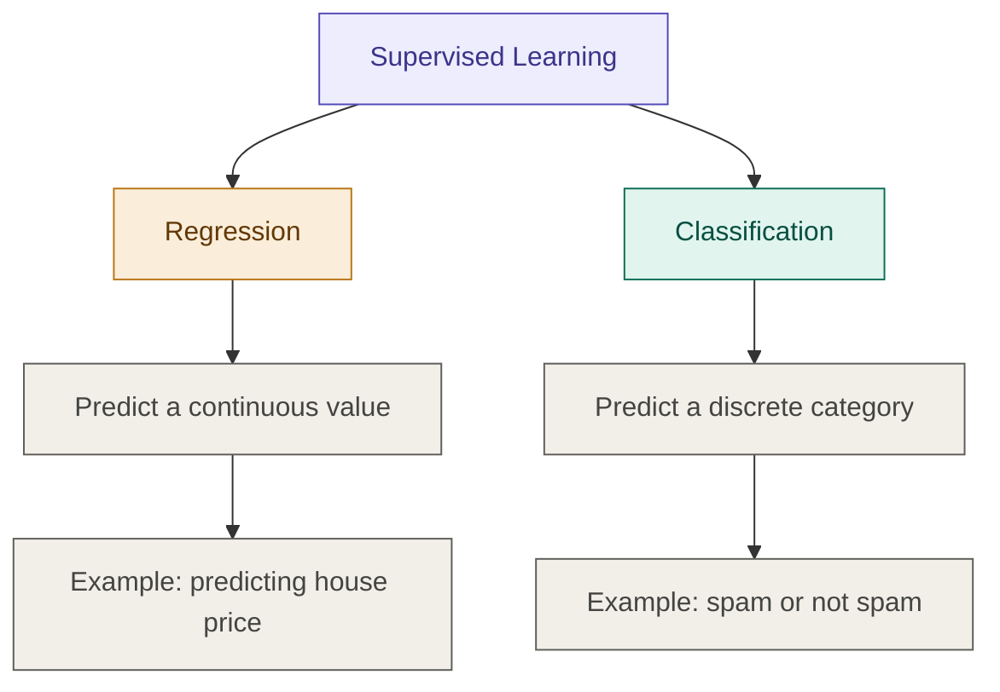
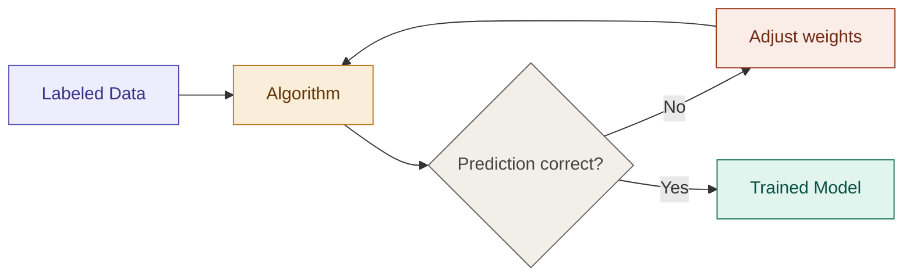

## Definition

Supervised Learning is a category of machine learning where the algorithm
learns a mapping from input data to output labels, using a dataset where
the correct answers are already known.

The algorithm learns under guidance — correcting itself each time it makes
a mistake, using labeled examples as the source of truth.

## The Core Idea Mathematically

Given a dataset of $n$ examples:

$$\mathcal{D} = \{(x_1, y_1),\ (x_2, y_2),\ \dots,\ (x_n, y_n)\}$$

Each pair $(x_i, y_i)$ is one example from the dataset:

- $x_i$ — the input features (what we know)
- $y_i$ — the target label (what we want to predict)
- $i$ — an index, counting from $1$ to $n$

The goal is to learn a **hypothesis function** $h_\theta(x)$ such that:

$$h_\theta(x) \approx y$$

Where $\theta$ (theta) is a **vector of parameters** — the internal numbers
the algorithm tunes during training. The hypothesis function $h_\theta$ is
just a mathematical rule that takes input $x$ and produces a prediction,
and $\theta$ controls the shape of that rule.

$$\theta = \begin{bmatrix} \theta_0 \\ \theta_1 \\ \vdots \\ \theta_n \end{bmatrix}$$

The algorithm finds the best $\theta$ by minimizing a **loss function**
$\mathcal{L}$ — a score that measures how wrong the predictions are.
The smaller the loss, the better the model.

$$\text{Best } \theta = \text{the } \theta \text{ that makes }
\sum_{i=1}^{n} \mathcal{L}(h_\theta(x_i),\ y_i)
\text{ as small as possible}$$

In plain words:

> Pick a $\theta$. Compute predictions. Measure total error.
> Adjust $\theta$. Repeat until the error is minimised.
> The final $\theta$ defines your trained model.

> Each supervised learning model is a different choice of $h_\theta$
> and $\mathcal{L}$. That is the only real difference between them.

## The Two Problems

## The Learning Process

## Key Principle

> Garbage In = Garbage Out.
> The function $h_\theta(x)$ is only as good as the labels $y_i$.
> Noisy or incorrect labels produce a broken model —
> no algorithm can recover from bad supervision.

## Models

### Regression

| Model | Best For |
|---|---|
| [[Linear Regression]] | Continuous output, linear relationship |
| [[Decision Trees]] | Non-linear relationships, interpretable |
| [[Random Forest]] | High accuracy, handles noise well |
| [[Support Vector Machines]] | High-dimensional data |

### Classification

| Model | Best For |
|---|---|
| [[Logistic Regression]] | Binary classification, probability output |
| [[Decision Trees]] | Multi-class, interpretable rules |
| [[Random Forest]] | Robust multi-class classification |
| [[Support Vector Machines]] | Clear margin between classes |
| [[K-Nearest Neighbours]] | Simple, instance-based classification |

---

## Related Notes
- [[Machine Learning]]
- [[Unsupervised Learning]]
- [[Reinforcement Learning]]
- [[Loss Functions]]
- [[Overfitting and Underfitting]]

## References
- *Mathematics for Machine Learning* — Deisenroth et al. (mml-book.github.io)
- Stanford CS229 Lecture Notes — cs229.stanford.edu
- *Dive into Deep Learning* — d2l.ai