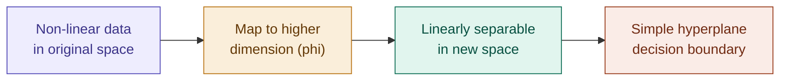

## Definition

A Support Vector Machine (SVM) is a supervised linear classification algorithm that finds the optimal decision boundary — a hyperplane — by maximizing the **margin**: the distance between the boundary and the closest points of any class.

## Motivation — Where Logistic Regression Falls Short

With [[Logistic Regression]], if $\theta^T x \gg 0$ we're very confident the label is 1; if $\theta^T x \ll 0$, very confident it's 0. Looking at this closely, the decision boundary is bound to be **linear**. But how would Logistic Regression separate classes when the data simply can't be split by a straight line?

In reality, almost all data that has ever existed shows signs of non-linearity — only a small minority of cases can be understood with a simple linear decision boundary.

## The Solution — Map to Higher Dimensions

To find a non-linear decision boundary, map input features $x_1, x_2$ to a higher dimension — like $x_1 x_2$, $x_1^2$, $x_2^2$, or $x_1^2+x_2^2$. This reveals patterns hidden in the correlation of input features that weren't visible in the original space.

> **The tangled ropes analogy:** imagine multiple ropes tangled and lying on the floor. It's difficult to imagine untangling them just by looking from the top-down view — you have to lift a few open ends into the 3rd dimension to actually see the pattern that lets you untangle them. Mapping data to higher dimensions works the same way: a 2D-inseparable dataset can become trivially separable once lifted into 3D.

Concretely: a circular 2D distribution that can't be split by any straight line becomes linearly separable once mapped to $\phi = (x_1^2 + x_2^2)$ — a single new axis representing distance from the origin. Mapping input features to a higher dimension to find a _simpler_ decision boundary is the core concept of the Support Vector Machine.

## Key Concepts

**Hyperplane:** in an $n$-dimensional space, a hyperplane is a flat affine subspace of dimension $n-1$. For 2D data it's a line; for 3D data it's a plane; for higher dimensions it's a hyperplane — impossible to visualize directly, but the math works perfectly regardless.

**Support Vectors:** the data points that lie closest to the decision boundary (the hyperplane). They're critical because they define the margin and fully determine the position of the hyperplane. If you remove any _other_ data point, the hyperplane doesn't shift — but if you remove a support vector, the hyperplane's position shifts.

**Margin:** the distance between the hyperplane (decision boundary) and the closest data points (the support vectors) from any class. SVM's aim is to **maximize** this margin, since a large margin generally leads to better generalization on unseen data.

## Which Boundary Is Actually Optimal?

Given two candidate decision lines that both separate the classes correctly, which is better — the one that cuts close to one class, or the one that stays equidistant from both?

The equidistant one wins. A boundary that sits much closer to one class than the other isn't optimal, even if it perfectly separates the training data — it leaves far less room for error on unseen points near that closer class. That's exactly what SVM is doing by maximizing the geometric margin.

## Linear vs. Non-Linear SVMs

- **Linearly separable data:** classes can be neatly separated by a straight line, hyperplane, or flat plane — a linear SVM is used.
- **Non-linearly separable data:** data cannot be separated by a linear boundary in its current dimension (e.g. a circular distribution) — SVM uses the **kernel trick**.

## The Kernel Trick (Preview)

SVM works by transforming data into a higher dimension to find a decision boundary — but that transformation is computationally expensive to do explicitly. **Kernels** are mathematical functions that help find which higher dimension or vector order finds the decision boundary most efficiently, without ever explicitly computing the transformed coordinates.

**How it works:** a kernel function computes the dot-product of data points (as in the $x_1^2+x_2^2$ example above) in a higher-dimensional feature space, without explicitly calculating the coordinates of the transformation.

**Common kernel types:**

|Kernel|Use Case|
|---|---|
|Linear|Simple, linearly separable data|
|Polynomial|Similarity of vectors over polynomials of the original variables|
|Radial Basis Function (RBF)|Popular default; maps data into an infinite-dimensional space, handles complex non-linear relationships|
|Sigmoid|Equivalent to a two-layer perceptron neural network|

> Notation: the higher-dimension calculation is denoted $\phi$ (a vector), e.g. $\phi = [x_1, x_2, x_1^2, x_2^2, x_1x_2, \dots]$

## Advantages of SVM

- **Effective in high dimensions:** highly efficient even when the number of features exceeds the number of samples.
- **Memory efficient:** uses only a subset of training points (the support vectors) in the decision function.
- **Versatile:** different kernel functions can be specified for custom decision boundaries.

## Limitations of SVM

- **Not suitable for very large datasets:** training time scales quadratically or cubically with the number of samples.
- **Sensitive to noise:** outliers can heavily impact the margin and final decision boundary (soft-margin tuning helps mitigate this).
- **No direct probability estimates:** calculating probability values is expensive and requires cross-validation.

## Building SVM — The Roadmap

Deriving SVM means working through three building blocks sequentially — think of them as organs of SVM, each with a separate job:

1. **Optimal Margin Classifier** (separable case)
2. **Kernels**
3. **Inseparable cases** (soft margin)

## Optimal Margin Classifier — Functional Margin

The Optimal Margin Classifier is a supervised linear classification algorithm that creates a decision boundary — a hyperplane — by maximizing the distance (margin) between the closest points of any class (support vectors) and the boundary itself. It establishes the foundational linear model that generalizes best, by ensuring the separating hyperplane is as far from the training data as possible.

**Functional margin** — how confidently and accurately you classify an example. Start with something familiar: $h_\theta(x) = g(\theta^T x)$ from Logistic Regression.

Now $h_\theta(x)$ predicts binary classification (0/1 or Yes/No):

$$\text{predict} = \begin{cases} \text{"1"} & \text{if } \theta^T x > 0 \ \text{"0"} & \text{if } \theta^T x < 0 \end{cases} \qquad \text{i.e. } h_\theta(x) = g(\theta^T x) \geq 0.5$$

In other words: if $y^{(i)}=1$, we hope $\theta^T x^{(i)} \gg 0$; if $y^{(i)}=0$, we hope $\theta^T x^{(i)} \ll 0$. If the model is doing great and the label is 1, the model predicts a value much higher than 0 (close to 1). Symmetrically for label 0, close to 0 means the prediction is much less than 0.

**This is a functional margin** — it captures this variation of prediction scale/confidence.

## Geometric Margin

Since we now have a way to formulate the hyperplane/decision boundary, we need a way to actually calculate the **distance** from data points to the decision boundary.

The geometric margin represents the actual **Euclidean distance** from a training example $x^{(i)}$ to the decision boundary (hyperplane) defined by $w^Tx+b=0$ (equivalently $\theta^Tx=0$).

**Relationship to functional margin:** the geometric margin $\gamma^{(i)}$ for a single training example is related to the functional margin $\hat\gamma^{(i)}$ by dividing it by the Euclidean norm of the weight vector $w$:

$$\boxed{\gamma^{(i)} = \frac{\hat\gamma^{(i)}}{|w|}}$$

**Scale invariance:** unlike the functional margin, the geometric margin is **invariant to scaling** — multiplying $w$ and $b$ by any constant $c$ doesn't change the geometric margin, because the scaling cancels out between the numerator and the $|w|$ in the denominator.

## The Problem With Functional Margin

The functional margin can be artificially inflated by scaling parameters $w$ and $b$ by any number, without actually changing the decision boundary at all. Multiplying $w$ and $b$ by $c$ directly multiplies the functional margin by $c$ — meaning the functional margin is easy to "cheat" or inflate without making the classifier any better.

**The fix:** normalize the parameters, e.g. $(w,b) \rightarrow \left(\frac{w}{|w|}, \frac{b}{|w|}\right)$, or any other scaling like $(w,b) \rightarrow \left(\frac{w}{2},\frac{b}{2}\right)$. Even after any such scaling or normalizing, the classification and decision boundary stay exactly the same — this is precisely why the geometric margin (which is scale-invariant by construction) is the quantity SVM actually optimizes, not the functional margin.

## Implementation

- [[../Implementation/Classification/svm_margins.py]]

---

## Related Notes

- [[Logistic Regression]]
- [[Kernels]]

## References

- _Mathematics for Machine Learning_ — Deisenroth et al. (mml-book.github.io)
- Stanford CS229 Lecture Notes — cs229.stanford.edu
- _Dive into Deep Learning_ — d2l.ai